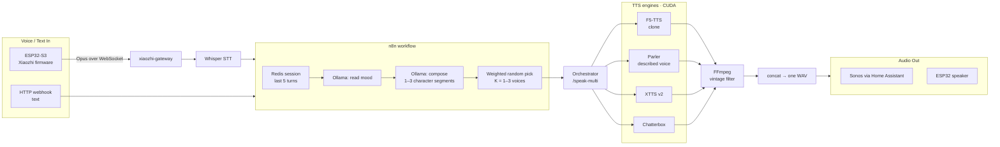

# 🐝 Bumblebee Bot

> An alien who lost his voice box. He can only answer you by replaying snippets he's intercepted from Earth's old radio and TV broadcasts — cloned into the right voice and run through a vintage filter so it sounds like a recording pulled out of the static.

You type or speak a phrase. Bumblebee reads your mood, "tunes" to the closest character in his memory of 1950s–70s broadcasting, and plays back a short, period-authentic clip *as if he found exactly the right channel*. When he misreads you, he plays the wrong channel — and that's part of the joke.

This repo is the full build: a local, GPU-accelerated voice pipeline running on Unraid + Docker, orchestrated with n8n and Ollama, with ESP32 (Xiaozhi) devices for hands-free voice in/out.

---

## What it does

**Example:** you type *"the kitchen's an absolute warzone after the kids' party."*
Bumblebee reads it as `amuse / light`, tunes to **David Attenborough**, and narrates your messy kitchen as if it were a wildlife documentary — in his voice, through a 1970s broadcast filter.

---

## Why it's built this way

Bumblebee's clip choice is **intentional, not random** (this is canon across the films, *Transformers: Prime*, and the IDW comics). His mind is fully intact — only the *output* is damaged. So the system mirrors that: an LLM understands your situation, decides a communicative intent, picks the character who fits, and writes a line that *sounds like* a real period broadcast. The mismatch when it's slightly off is the character, not a bug.

Full reasoning and lore: **[Concept & Lore](docs/Concept-and-Lore.md)**.

---

## Stack

| Layer | Tech | Notes |
|---|---|---|
| LLM | **Ollama** (local, CUDA) | Mood inference + in-character message composition |
| TTS | **F5-TTS · Parler · XTTS v2 · Chatterbox** | Clone from a reference clip, or synthesize a described voice |
| Audio | **FFmpeg** | Per-character "vintage broadcast" filter chain |
| Orchestrator | **Python / FastAPI** | Routes to the right TTS, runs FFmpeg, stitches segments, serves the WAV |
| Workflow | **n8n** | Webhook → Ollama → orchestrator → playback |
| Session | **Redis** | Last 5 turns, 5-minute TTL — volatile, no DB bloat |
| Voice in (primary) | **ESP32-S3 + Xiaozhi** → gateway → **Whisper** | Hands-free wake-word capture |
| Audio out | **Sonos** (via Home Assistant) and/or the ESP32 speaker | Per-device routing |
| Host | **Unraid + Docker**, 2× NVIDIA GPU | All inference stays local |

---

## Documentation (the detail lives in the Wiki / `docs/`)

The README is the hook; everything below is written up in full under [`docs/`](docs/) and mirrored to the **[Wiki](../../wiki)**:

- **[Concept & Lore](docs/Concept-and-Lore.md)** — what Bumblebee is and the design rules
- **[Architecture & Workflow](docs/Architecture-and-Workflow.md)** — diagrams: pipeline, request lifecycle, multi-device topology
- **[Docker Containers](docs/Docker-Containers.md)** — the 8 services, building, publishing, and custom Unraid icons
- **[Unraid Template](docs/Unraid-Template.md)** — Community Apps install + env vars
- **[STT Options](docs/STT-Options.md)** — speech-to-text choices and how to swap them
- **[TTS Options](docs/TTS-Options.md)** — engine comparison and when to use each
- **[Voice Input: Alexa → ESP32/Xiaozhi](docs/Voice-Input-Alexa-vs-ESP32.md)** — what we tried, what didn't work, and your options
- **[Input Metadata Schema](docs/Input-Metadata-Schema.md)** — the mood fields the LLM extracts and what they drive
- **[Character & Response Table](docs/Character-Response-Table.md)** — how characters are chosen by mood

---

## Status

The core pipeline is **working end-to-end**: text/voice in → mood → 1–3 character voices → vintage filter → played on Sonos. The main frontier is sourcing more reference clips (more clips = richer voice cloning) and finishing the multi-device ESP32 voice path. See the Wiki for the live roadmap.

## License

To be decided before this repository is made public.
