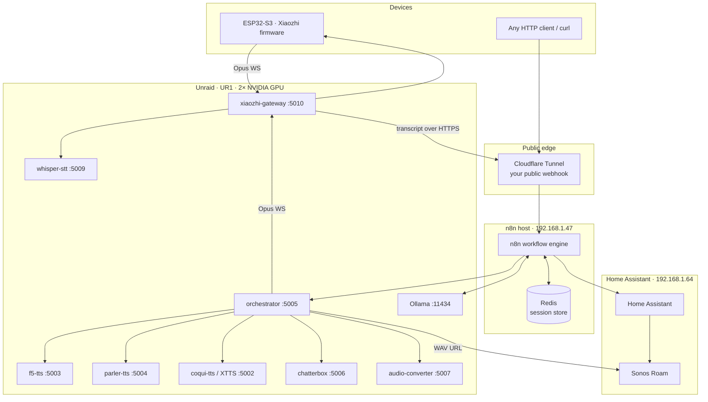
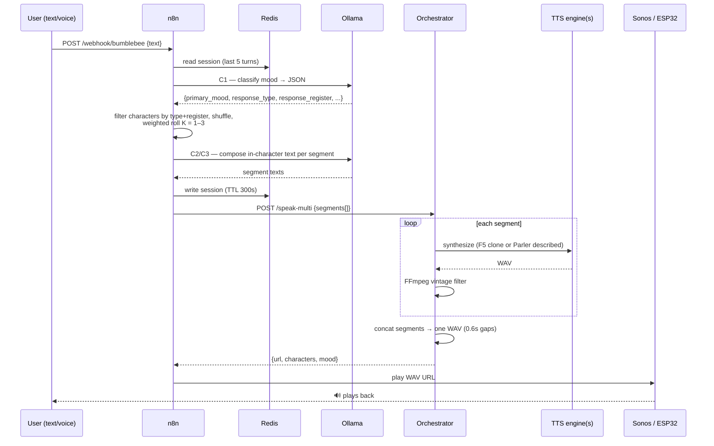
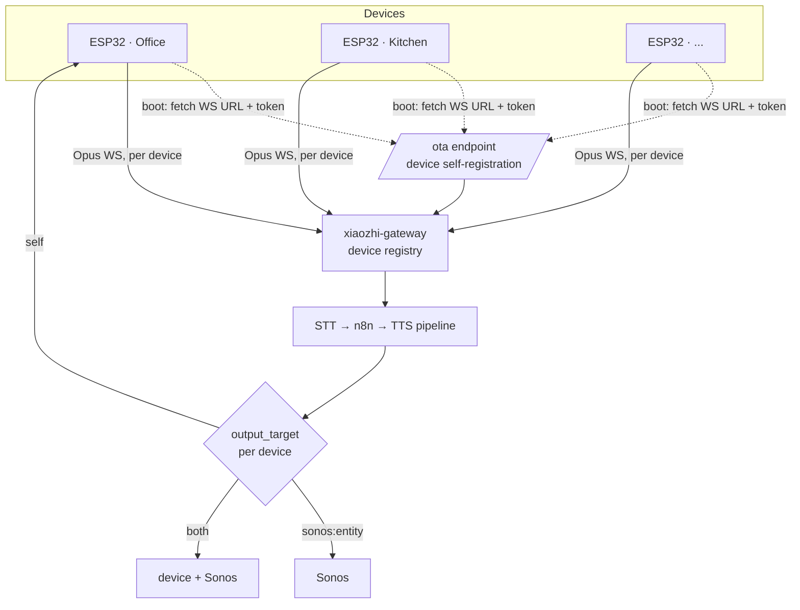

# Architecture & Workflow

Three views: the **system architecture** (what runs where), the **request lifecycle** (what happens to one message), and the **multi-device topology** (how several ESP32 devices share the pipeline).

This page is the overview. The n8n workflow itself is broken into four stage pages, each covering the nodes, inputs, and outputs of that step:

1. [Mood Classification (C1)](Workflow-Mood-Classification.md) — phrase → structured mood reading
2. [Character Selection](Workflow-Character-Selection.md) — mood → 1–3 cast voices
3. [Composition (C2/C3)](Workflow-Composition.md) — cast → in-character lines → render-ready segments
4. [Orchestration & Playback](Workflow-Orchestration-and-Playback.md) → audio URL → Sonos / ESP32

---

## 1. System architecture



All TTS/LLM inference stays **local** on Unraid. The two GPUs are split: the **RTX 3060** runs F5/Parler/Chatterbox, the **RTX 3090** runs XTTS, Whisper, and Ollama.

> **Networking gotcha — the gateway reaches n8n via the public webhook, not the LAN IP.** n8n runs on an Unraid **macvlan (`br0`)** interface, while `xiaozhi-gateway` is on the **`bumblebee_default` bridge**. Unraid blocks macvlan↔bridge traffic on the *same host*, so the gateway cannot hit n8n's `192.168.1.47:5678` directly (it fails with `All connection attempts failed`). It instead posts to the **Cloudflare Tunnel** URL (`https://<your-tunnel-domain>/webhook/bumblebee`), which dials outbound and sidesteps the isolation. The orchestrator's WAV URL (`192.168.1.33:5005`) *is* reachable from the bridge — that's UR1's own host IP, not a macvlan peer.

---

## 2. Request lifecycle (one message)



**Two-stage LLM:** the first Ollama call only *classifies* mood. The character pick is done in **JavaScript** in n8n (genuine weighted randomness — `P(1)=27% / P(2)=40% / P(3)=33%`, renormalised when fewer voices match), then a second Ollama call writes the in-character lines for the chosen voices.

**Engine routing & fallback:** each segment is tagged `f5` (a reference clip exists on disk) or `parler` (no clip → synthesize a described voice). If an `f5` clip is missing at render time, the orchestrator **auto-falls back to Parler** instead of erroring.

---

## 3. Multi-device topology (ESP32 voice I/O)



Design decisions (locked):
- **Output routing is per-device** (`self` | `sonos:<entity>` | `both`).
- **Onboarding via `/ota`** — a new device self-registers; no re-flash to add one.
- **One shared persona** — mood-driven only; no per-device voice override.

See [Voice Input: Alexa → ESP32/Xiaozhi](Voice-Input-Alexa-vs-ESP32.md) for the firmware/protocol detail.

---

## n8n node order (current)

The full node list in one place (each group is detailed on its stage page — see the four links at the top of this page):

```
Webhook
  → Read Session (Redis GET)
  → Build Ollama Request (mood classify prompt)
  → Ask Ollama
  → Parse Ollama Response  (filter by response_type, tighten by register,
                            Fisher–Yates shuffle, weighted roll 1..3,
                            build compose prompt)
  → Ask Ollama Compose
  → Parse Segments  (attach reference_clip / voice_description / tts_engine by name)
  → Write Session (Redis SET, TTL 300s)
  → Call Orchestrator (POST /speak-multi)
  → Respond (returns {status, count, characters, mood, url})
  → Play on Sonos
```

`Respond` is placed **before** `Play on Sonos` deliberately: Home Assistant's `play_media` returns an empty array, which would otherwise stop the workflow before the webhook responded. RespondToWebhook passes its input through, so Sonos still receives the `url`.
